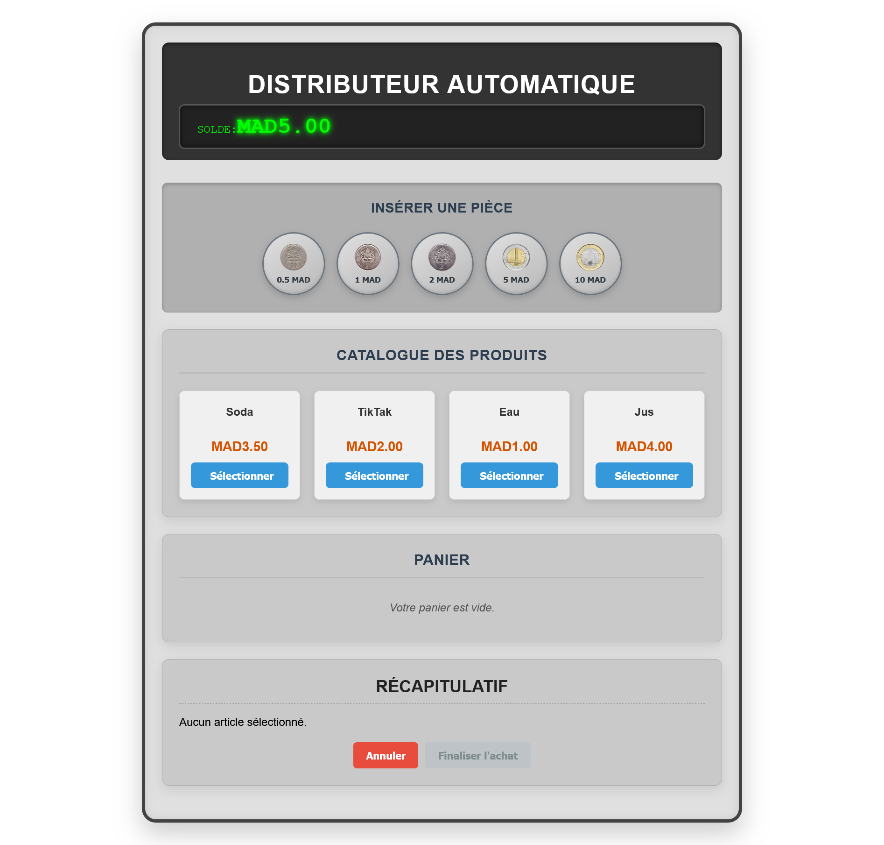

# Distributeur Automatique

**Auteur : EL MOUTAOUAKIL Abdellah**  
**Email : abdamota123@gmail.com**

Mise en œuvre d’une API modulaire et testable pour un distributeur automatique, en appliquant de bonnes pratiques d’architecture logicielle et de conception orientée objet. Ce projet inclut une API backend (Java Spring Boot) et une interface utilisateur frontend (Angular).

## Table des Matières

- [Objectif du projet](#objectif-du-projet)
- [Fonctionnalités à implémenter](#fonctionnalités-à-implémenter)
- [Exemple de scénarios utilisateur](#exemple-de-scénarios-utilisateur)
- [Contraintes et règles métiers](#contraintes-et-règles-métiers)
- [Consignes techniques](#consignes-techniques)
- [Attentes architecturales](#attentes-architecturales)
- [Bonus (Interface Graphique)](#bonus-interface-graphique)
- [Livrables Attendus](#livrables-attendus)
  - [Instructions d’installation et de lancement](#instructions-dinstallation-et-de-lancement)
    - [Prérequis](#prérequis)
    - [Lancement avec Docker Compose (Recommandé)](#lancement-avec-docker-compose-recommandé)
    - [Lancement manuel](#lancement-manuel)
  - [Démonstration de l'Interface Utilisateur (Frontend)](#démonstration-de-linterface-utilisateur-frontend)
  - [Démonstration de l’API](#démonstration-de-lapi)
  - [Hypothèses faites ou ajouts personnels](#hypothèses-faites-ou-ajouts-personnels)
  - [Les tests](#Les-tests)
  - [Diagramme de conception](#diagramme-de-conception)

---

## Objectif du projet

Concevoir et développer une API de distributeur automatique permettant de :

- Insérer des pièces de monnaie valides (MAD)
- Afficher la liste de tous les produits, en indiquant ceux qui sont achetables ou non
- Sélectionner un ou plusieurs produits
- Distribuer le(s) produit(s) si les fonds sont suffisants
- Rendre la monnaie si nécessaire

---

## Fonctionnalités à implémenter

1. **Insertion de pièces**

   - Accepte différentes valeurs (ex : 0,5 MAD, 1 MAD, 2 MAD, 5 MAD, 10 MAD)
   - Rejette les pièces invalides (valeur négative, non supportée, etc.)

2. **Catalogue des produits**

   - Affiche les produits disponibles avec :
     - Nom
     - Prix
     - Possibilité d’achat (calculée dynamiquement en fonction du solde disponible et des articles déjà sélectionnés)

3. **Sélection des produits**

   - Si l’argent inséré (moins le coût des articles déjà sélectionnés) est suffisant :
     - Le produit peut être ajouté au panier
     - Le solde effectif pour d'autres achats est mis à jour
   - Si le solde est insuffisant :
     - Le produit ne peut pas être ajouté au panier (il apparaît désactivé)

4. **Annulation d’une transaction**
   - Rembourse les pièces insérées
   - Réinitialise l’état de la transaction

---

## Exemple de scénarios utilisateur

### Scénario 1

- L’utilisateur insère 5 MAD
- Il choisit un soda coûtant 3,5 MAD
- La machine distribue le soda et rend 1,5 MAD de monnaie

### Scénario 2

- L’utilisateur insère 5 MAD
- Puis il insère 2 MAD
- Il choisit un soda coûtant 4,5 MAD
- Il choisit un TikTak coûtant 2 MAD
- La machine distribue le soda et le TikTak, et rend 0,5 MAD de monnaie

---

## Contraintes et règles métiers

- On suppose que la machine dispose d’un stock illimité de monnaie et de produits.
- Le rendu de la monnaie doit être optimisé (utilisation d’un algorithme glouton pour privilégier les pièces les plus grandes).

---

## Consignes techniques

- **Langages & Frameworks** :
  - Backend : Java 17, Spring Boot 3.5.0
  - Frontend : TypeScript, Angular 19.2.x
- **Code** : Clair, modulaire, lisible
- **Tests unitaires** :
  - Backend : JUnit / Mockito
  - Frontend : Karma / Jasmine (en cours)
- **Base de données** : H2 en mémoire (backend uniquement)

---

## Attentes architecturales

- Séparation claire des responsabilités (MVC, ou DDD côté backend)
- Utilisation appropriée des design patterns pour les règles métier
- Architecture par composants pour Angular

---

## Bonus (Interface Graphique)

Une interface utilisateur web simple et fonctionnelle a été implémentée avec Angular pour interagir avec l’API.

---

## Livrables Attendus

Le présent document constitue le README principal du projet. Le code source est disponible sur le dépôt GitHub associé.

---

### Instructions d’installation et de lancement

#### Prérequis

- [Docker](https://www.docker.com/get-started) + Docker Compose v3.8+
- [Git](https://git-scm.com/downloads)

**OU**, pour un lancement manuel :

- [Java JDK 17+](https://www.oracle.com/java/technologies/javase-jdk17-downloads.html)
- [Maven 3.6+](https://maven.apache.org/download.cgi)
- [Node.js 20+](https://nodejs.org/)
- [Angular CLI](https://angular.io/cli)

---

#### Lancement avec Docker Compose (Recommandé)

1. Clonez le dépôt :

   ```bash
   git clone https://github.com/Abdellah-EL-MOUTAOUAKIL-04/distributeur-automatique.git
   cd distributeur-automatique
   ```

2. Lancez les conteneurs :

   ```bash
   docker-compose up --build
   ```

3. Accès aux services :
   - Frontend : [http://localhost:4200](http://localhost:4200)
   - API Backend : [http://localhost:8080](http://localhost:8080)
   - Swagger : [http://localhost:8080/swagger-ui/index.html](http://localhost:8080/swagger-ui/index.html)

---

#### Lancement manuel

##### Backend

```bash
cd backend
mvn spring-boot:run
```

##### Frontend

```bash
cd frontend
npm install
ng serve
```

---

### Démonstration de l'Interface Utilisateur (Frontend)

Accès via : [http://localhost:4200](http://localhost:4200)

- **Page d’accueil** : liste des produits, insertion de pièces
- **Interactions** : mise à jour dynamique du solde, sélection des produits activée/désactivée
- **Transaction** :
  - Finaliser = produits + monnaie rendue
  - Annuler = solde remboursé

---

#### Le dsitributeur automatique

- la machine avec la quelle il interacte l'utilisateur.


#### On commence une operation

- en cliquant sur une piece monnaitre la transaction commence et lorsque on clique une autre fois il s'ajoute au solde les produits qui coute moins chere que le montant s'active.

## 

#### Le choix des produits

- on peut choisir les produits en se basant sur le solde quand a ,avec n'import quelle quantity en respectant seulement la condition que le total inferieur au solde des que tu attient le solde les produits ce desactive.


#### Finalisation de la transaction

- lorsque en clique sur finalise la transaction ce termine et il retourne l'echange d'une maniere optimiser et relance le solde a zero et si tu cliquer sur annuler la transaction sera annuler ,le panier videer et le solde a zero.


### Démonstration de l’API

**Obtenir les produits :**

```bash
curl -X GET http://localhost:8080/products
```

**Insérer une pièce (nouvelle transaction) :**

```bash
curl -X POST http://localhost:8080/transactions?insertedAmount=10
```

**Insérer dans une transaction existante :**

```bash
curl -X POST http://localhost:8080/transactions/{id}/insert?coin=5
```

**Sélectionner un produit :**

```bash
curl -X POST http://localhost:8080/transactions/{id}/select?productId=123
```

**Finaliser une transaction :**

```bash
curl -X POST http://localhost:8080/transactions/{id}/confirm
```

**Annuler une transaction :**

```bash
curl -X POST http://localhost:8080/transactions/{id}/cancel
```


---

### Hypothèses faites ou ajouts personnels

- Stock illimité simulé
- Algorithme glouton pour rendre la monnaie
- UI pensée pour la simplicité et la clarté

---

### Les tests

- Comme vous remaarques les tests sont bien passer.

## 

### Diagramme de conception

#### Diagramme de classe :


#### Diagramme de sequance :


---

© Réalisé par **EL MOUTAOUAKIL Abdellah** – [abdamota123@gmail.com](mailto:abdamota123@gmail.com)
